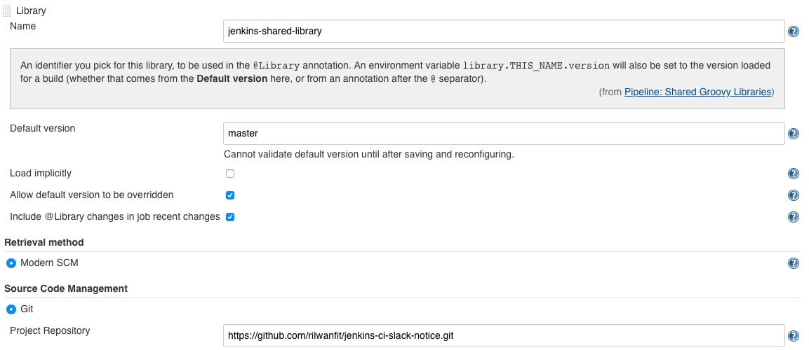

# jenkins-ci-slack-notice

## Configure this Git repository as our shared library in jenkins

Manage Jenkins → Configure System → Global Pipeline Libraries → Add

## Configure Slack Notification plugin
Access your Slack Workspace and go to Administration → Manage apps or visit https://your-workspace.slack.com/apps and browse for the Jenkins app.

### Develop Slack Notifier in Groovy
a groovy script which will send Slack notifications based on the build result.
vars/slackNotifier.groovy

## Create Jenkins pipeline
which will use our shared library and get the slackNotifier.groovy from there.
